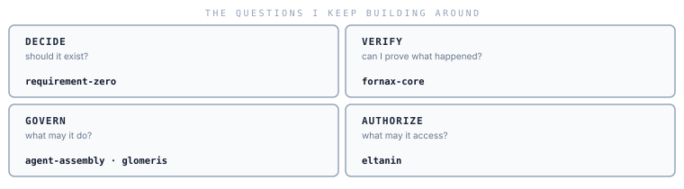

I build the boundaries between AI autonomy and the systems that must trust it.

 

<picture>
  <source media="(prefers-color-scheme: dark)" srcset="assets/map-dark.svg">
  
</picture>

 

---

## What exists today

### 🧪 Fornax — AI behavior integrity

  

AI systems produce outputs, execute actions, and narrate what they did — but their own account is often the only record. Fornax makes that account independently inspectable: it captures immutable execution evidence, checks each claim against it, and returns `VERIFIED`, `UNVERIFIED`, `CONTRADICTED`, or `UNAVAILABLE`. The signal taxonomy covers execution traces, reasoning summaries, and model-internal telemetry; those paths activate as providers expose them.

**First surface:** Coding agents (Claude Code, Codex, opencode). The domain is provider-agnostic by design.

**Current boundary:** Only execution-trace evidence is collected today; 22% recall on ground-truth-positive cases. Model-internal signals depend on provider exposure — Fornax does not manufacture inaccessible signals.

[source](https://github.com/horonomy/fornax-core) · [architecture invariants](https://github.com/horonomy/fornax-core/blob/main/docs/adr/0001-architecture-invariants.md)

---

### ⚙️ Agent Assembly — AI agent governance

  

Every AI agent action happens under some authority — but who granted it, under what policy, and what actually occurred is rarely observable. Agent Assembly is governance infrastructure: policy enforcement on every agent action, a tamper-evident audit trail, and independently deployable enforcement mechanisms each with an explicit capability boundary. An absent mechanism is reported absent, never assumed present.

**First surface:** AI developer tools (Claude Code focus), with an evidence-backed protection-level lifecycle from detection through host enforcement.

**Current boundary:** RC series — API not stable; eBPF terminates processes after the fact, not before.

[source](https://github.com/ai-agent-assembly/agent-assembly) · [limitations and known bypasses](https://github.com/ai-agent-assembly/agent-assembly/blob/main/docs/src/devtools/limitations.md)

---

### 🛡️ Eltanin — protected compute authorization

  

Protected compute — hardware accelerators and other high-value resources — should not be reachable by default. Eltanin enforces that default-deny posture: a workload must hold a scoped, expiring authorization or the resource stays closed. Monitoring usage after the fact does not satisfy this requirement. The domain is vendor-neutral; vendor-specific backends attach at a defined boundary.

**First surface:** Linux/NVIDIA as the hard device-enforcement proof target; Apple Silicon/Metal as a distinct functional evidence class.

**Current boundary:** Linux/NVIDIA enforcement crates are not yet merged; device-level enforcement is not proven on hardware.

[source](https://github.com/horonomy/eltanin) · [security model](https://github.com/horonomy/eltanin/blob/main/docs/product/SECURITY_MODEL.md) · [North Star](https://github.com/horonomy/eltanin/blob/main/docs/product/NORTH_STAR.md)

---

### 🧰 Glomeris — policy-constrained storage autopilot

  

Disk cleanup that defers to AI recommendations without a deterministic policy gate is dangerous. Glomeris discovers reclaimable developer storage on macOS, explains why each candidate is or isn't safe to remove, and executes only policy-approved typed actions — re-measuring actual freed bytes. An optional LLM may rank candidates; it cannot invent or authorize a deletion.

**Current boundary:** macOS-only experimental MVP; Homebrew and Docker cache cleanup have architectural constraints that limit safe execution.

[source](https://github.com/Chisanan232/glomeris) · [safety model](https://chisanan232.github.io/glomeris/safety_model.html) · [known limitations](https://chisanan232.github.io/glomeris/known_limitations.html)

---

### 📐 Requirement Zero — decision discipline before implementation

  

Faster AI-assisted implementation makes it easier to efficiently produce work that should never have existed. Requirement Zero enforces a decision gate before planning or writing code: trace the requirement to its fundamental objective and observable evidence, then reach a verdict — DELETE, REDUCE, DEFER, BUILD, or BUILD HARD. Codebase Zero applies the same discipline to existing artifacts.

**Delivered as:** Agent Skills for AI coding agent workflows.

**Current boundary:** Evaluation on six cases shows modest accuracy improvement; downstream cost savings are unmeasured.

[source](https://github.com/Chisanan232/requirement-zero) · [evaluation results](https://github.com/Chisanan232/requirement-zero/blob/main/eval/results/2026-08-15-claude-sonnet-4-6.md)

---

## How I tend to build

**Evidence over claims.** Observations are recorded before any interpretation runs. Missing capability is `UNAVAILABLE`, not a pass.

**Failure paths are part of the design.** What happens when enforcement is absent, evidence is missing, or authorization is refused matters as much as the happy path.

**Security boundaries stay explicit.** Compatibility is not protection. An absent mechanism is reported as absent.

**Negative results stay visible.** An evaluation superseded because its confound made numbers too favorable is published with the less favorable corrected results.

---

## What I'm currently working through

- Can AI behavior and claims be verified externally without modifying the system being observed? The Fornax hook model tests this for coding agents; the harder question is whether the pattern generalizes.
- Which enforcement mechanism in an agent governance stack actually prevents unauthorized action — in-process SDK, sidecar proxy, or kernel-level eBPF — and what does each one genuinely stop versus observe?
- How do you prove "no protected compute without authorization" on real hardware rather than in a simulator?

---

## Older systems

**[PyFake-API-Server](https://github.com/Chisanan232/PyFake-API-Server)** · 🛠️ Maintenance paused · `v0.4.2` · [PyPI](https://pypi.org/project/fake-api-server/)  
Configurable mock HTTP server; define API responses in YAML or import from an OpenAPI spec.

**[multirunnable](https://github.com/Chisanan232/multirunnable)** · 🗃️ Legacy · `v0.17.0` · [PyPI](https://pypi.org/project/multirunnable/)  
Unified Python API across multiprocessing, threading, gevent, and asyncio.

---

## Elsewhere

**[@horonomy](https://github.com/horonomy)** — Fornax · Eltanin  
**[@ai-agent-assembly](https://github.com/ai-agent-assembly)** — Agent Assembly  
Software Engineer · LINE corp.
