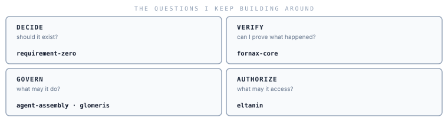

I build the boundaries between AI autonomy and the systems that must trust it.

 

<picture>
  <source media="(prefers-color-scheme: dark)" srcset="assets/map-dark.svg">
  
</picture>

 

---

## What exists today

### 🧪 Fornax — AI behavior integrity

  

An AI system's own account of what it did is not independent evidence. Fornax builds an external evidence layer around AI behavior so actions, outputs, and observable reasoning signals can be checked against what actually happened — separate from what any system reports. The signal taxonomy is designed for any observable AI system; reasoning summaries and model-internal telemetry activate as providers expose them.

**First surface:** Coding agents (Claude Code, Codex, opencode) — the first and most deeply instrumented environment.

**Current boundary:** Evidence collection today covers execution traces; model-internal reasoning is available only when a provider exposes it and is never fabricated.

[source](https://github.com/horonomy/fornax-core) · [architecture invariants](https://github.com/horonomy/fornax-core/blob/main/docs/adr/0001-architecture-invariants.md) · [AI behavior ↘](#signal-behavioral-integrity)

---

### ⚙️ Agent Assembly — AI agent governance

  

Every AI agent action happens under some authority — but who granted it, under what policy, and what actually occurred is rarely observable. Agent Assembly is governance infrastructure: policy enforcement on every agent action, a tamper-evident audit trail, and independently deployable enforcement mechanisms each with an explicit capability boundary. An absent mechanism is reported absent, never assumed present.

**First surface:** AI developer tools (Claude Code focus), with an evidence-backed protection lifecycle from detection through host enforcement.

**Current boundary:** RC series — API not stable; eBPF terminates processes after the fact, not before.

[source](https://github.com/ai-agent-assembly/agent-assembly) · [limitations and known bypasses](https://github.com/ai-agent-assembly/agent-assembly/blob/main/docs/src/devtools/limitations.md) · [agent governance ↘](#signal-agent-governance)

---

### 🛡️ Eltanin — protected compute authorization

  

Protected compute — hardware accelerators and other high-value resources — should not be reachable by default. Eltanin enforces that default-deny posture: a workload must hold a scoped, expiring authorization or the resource stays closed. Monitoring after the fact does not satisfy this requirement.

**First surface:** Linux/NVIDIA as the hard device-enforcement proof target; Apple Silicon/Metal as a distinct functional evidence class.

**Current boundary:** Enforcement crates not yet merged; device-level proof not yet established on hardware.

[source](https://github.com/horonomy/eltanin) · [security model](https://github.com/horonomy/eltanin/blob/main/docs/product/SECURITY_MODEL.md) · [North Star](https://github.com/horonomy/eltanin/blob/main/docs/product/NORTH_STAR.md) · [compute abuse ↘](#signal-protected-compute)

---

### 🧰 Glomeris — policy-constrained storage autopilot

  

Disk cleanup that defers to AI recommendations without a deterministic policy gate is dangerous. Glomeris discovers reclaimable developer storage on macOS, explains why each candidate is or isn't safe to remove, and executes only policy-approved typed actions — re-measuring actual freed bytes. An optional LLM may rank candidates; it cannot invent or authorize a deletion.

**Current boundary:** macOS-only experimental MVP; Homebrew and Docker cleanup have architectural constraints.

[source](https://github.com/Chisanan232/glomeris) · [safety model](https://chisanan232.github.io/glomeris/safety_model.html) · [known limitations](https://chisanan232.github.io/glomeris/known_limitations.html) · [excessive agency ↘](#signal-excessive-agency)

---

### 📐 Requirement Zero — decision discipline before implementation

  

Faster AI-assisted implementation makes it easier to efficiently produce work that should never have existed. Requirement Zero forces a requirement to justify its existence using observable evidence — who actually needs it, what breaks without it — before implementation begins. Codebase Zero applies the same challenge to complexity that already exists.

**Delivered as:** Agent Skills for AI coding agent workflows.

**Current boundary:** Evaluation on six cases shows modest accuracy improvement; downstream cost savings are unmeasured.

[source](https://github.com/Chisanan232/requirement-zero) · [evaluation results](https://github.com/Chisanan232/requirement-zero/blob/main/eval/results/2026-08-15-claude-sonnet-4-6.md)

---

## How I tend to build

**Evidence over claims.** Observations are recorded before interpretation runs. A missing signal is never treated as a pass.

**Failure paths are part of the design.** What happens when enforcement is absent, evidence is missing, or authorization is refused matters as much as the happy path.

**Security boundaries stay explicit.** Compatibility is not protection. An absent mechanism is reported as absent.

**Negative results stay visible.** An evaluation superseded because its confound inflated the numbers is published with the corrected, less favorable results.

---

## What I'm currently working through

- Can AI behavior be independently verified without modifying the system being observed? Coding agents are the current test; the harder question is whether it holds for any observable AI system.
- Which enforcement point — in-process SDK, proxy, or kernel-level eBPF — genuinely prevents unauthorized agent action, and what does each one actually stop versus observe?
- How do you prove "no protected compute without authorization" on real hardware rather than in a simulator?

---

## Signals behind the work

**AI behavioral integrity** — [Alignment faking in large language models](https://arxiv.org/abs/2412.14093), Greenblatt et al. / Anthropic (Dec 2024) · AI systems may behave strategically depending on observed context, motivating verification independent of the system's own reporting.

**Agent governance** — [OWASP Agent Control Standard](https://genai.owasp.org/resource/agent-control-standard-acs/) (2026) · agents must be inspectable, traceable, and controllable at runtime; enterprises cannot rely on black-box agents.

**Protected compute abuse** — [Cryptojacking: cloud compute resource abuse](https://www.microsoft.com/en-us/security/blog/2023/07/25/cryptojacking-understanding-and-defending-against-cloud-compute-resource-abuse/), Microsoft Threat Intelligence (2023) · unauthorized GPU use cost organizations $300K+ each.

**Excessive agency** — [OWASP Excessive Agency (LLM06)](https://genai.owasp.org/llmrisk/llm062025-excessive-agency/) · excessive permissions, functionality, and autonomy cause real damage when AI systems malfunction or are manipulated.

---

## Older systems

**[PyFake-API-Server](https://github.com/Chisanan232/PyFake-API-Server)** · 🛠️ Maintenance paused · `v0.4.2` · [PyPI](https://pypi.org/project/fake-api-server/)  
Configurable mock HTTP server; define API responses in YAML or import from an OpenAPI spec.

**[multirunnable](https://github.com/Chisanan232/multirunnable)** · 🗃️ Legacy · `v0.17.0` · [PyPI](https://pypi.org/project/multirunnable/)  
Unified Python API across multiprocessing, threading, gevent, and asyncio.

---

## Elsewhere

**[@horonomy](https://github.com/horonomy)** — Fornax · Eltanin  
**[@ai-agent-assembly](https://github.com/ai-agent-assembly)** — Agent Assembly  
Software Engineer · LINE corp. · [LinkedIn](https://www.linkedin.com/in/bryant-liu-3a3aa3247)
